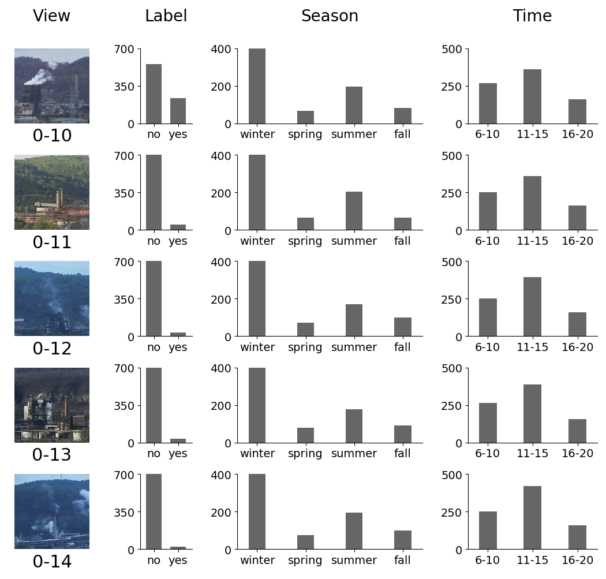
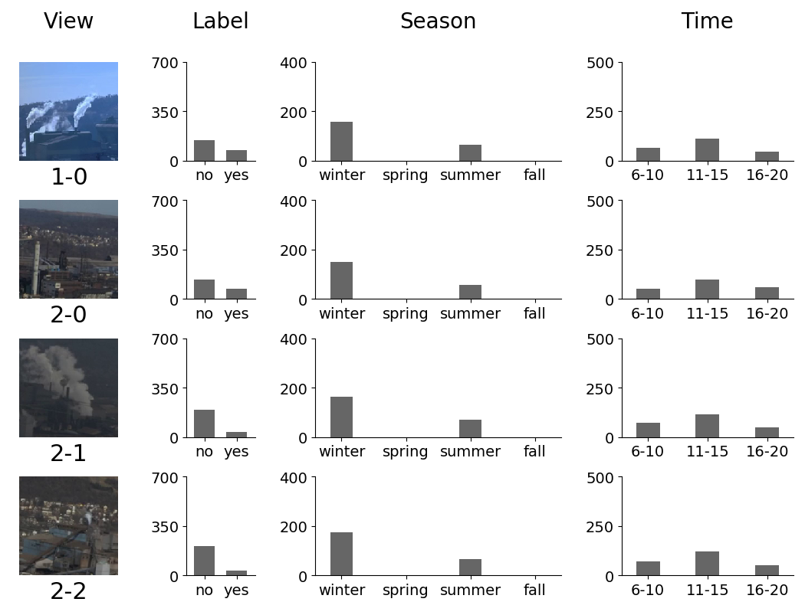

# deep-smoke-machine
Deep learning models and dataset for recognizing industrial smoke emissions. The videos are from the [smoke labeling tool](https://github.com/CMU-CREATE-Lab/video-labeling-tool). The code in this repository assumes that Ubuntu 18.04 server is installed. The code is released under the BSD 3-clause license, and the dataset is released under the Creative Commons Zero (CC0) license. If you found this dataset and the code useful, we would greatly appreciate it if you could cite our technical report below:

Yen-Chia Hsu, Ting-Hao (Kenneth) Huang, Ting-Yao Hu, Paul Dille, Sean Prendi, Ryan Hoffman, Anastasia Tsuhlares, Randy Sargent, and Illah Nourbakhsh. 2020. Project RISE: Recognizing Industrial Smoke Emissions. arXiv preprint arXiv:2005.06111. https://arxiv.org/abs/2005.06111


The following figures show how the [I3D model](https://arxiv.org/abs/1705.07750) recognizes industrial smoke. The heatmaps (red and yellow areas on top of the images) indicate where the model thinks have smoke emissions. The examples are from the testing set with different camera views, which means that the model never sees these views at the training stage. These visualizations are generated by using the [Grad-CAM](https://arxiv.org/abs/1610.02391) technique. The x-axis indicates time.


### Table of Content
- [Install Nvidia drivers, cuda, and cuDNN](#install-nvidia)
- [Setup this tool](#setup-tool)
- [Use this tool](#use-this-tool)
- [Code infrastructure](#code-infrastructure)
- [Dataset](#dataset)
- [Pretrained models](#pretrained-models)
- [Deploy models to recognize smoke](#deploy-models-to-recognize-smoke)
- [Acknowledgements](#acknowledgements)

# <a name="install-nvidia"></a>Install Nvidia drivers, cuda, and cuDNN
Disable the nouveau driver.
```sh
sudo vim /etc/modprobe.d/blacklist.conf
# Add the following to this file
# Blacklist nouveau driver (for nvidia driver installation)
blacklist nouveau
blacklist lbm-nouveau
options nouveau modeset=0
alias nouveau off
alias lbm-nouveau off
```
Regenerate the kernel initramfs.
```sh
sudo update-initramfs -u
sudo reboot now
```
Remove old nvidia drivers.
```
sudo apt-get remove --purge '^nvidia-.*'
sudo apt-get autoremove
```
If using a desktop version of Ubuntu (not the server version), run the following:
```
sudo apt-get install ubuntu-desktop # only for desktop version, not server version
```
Install cuda and the nvidia driver. Documentation can be found on [Nvidia's website](https://docs.nvidia.com/cuda/).
```sh
sudo apt install build-essential
sudo apt-get install linux-headers-$(uname -r)
wget https://developer.nvidia.com/compute/cuda/10.1/Prod/local_installers/cuda_10.1.168_418.67_linux.run
sudo sh cuda_10.1.168_418.67_linux.run
```
Check if Nvidia driver is installed. Should be no nouveau.
```sh
sudo nvidia-smi
dpkg -l | grep -i nvidia
lsmod | grep -i nvidia
lspci | grep -i nvidia
lsmod | grep -i nouveau
dpkg -l | grep -i nouveau
```
Add cuda runtime library.
```sh
sudo bash -c "echo /usr/local/cuda/lib64/ > /etc/ld.so.conf.d/cuda.conf"
sudo ldconfig
```
Add cuda environment path.
```sh
sudo vim /etc/environment
# add :/usr/local/cuda/bin (including the ":") at the end of the PATH="/[some_path]:/[some_path]" string (inside the quotes)
sudo reboot now
```
Check cuda installation.
```sh
cd /usr/local/cuda/samples
sudo make
cd /usr/local/cuda/samples/bin/x86_64/linux/release
./deviceQuery
```
Install cuDNN. Documentation can be found on [Nvidia's website](https://docs.nvidia.com/deeplearning/sdk/cudnn-install/index.html#install-linux). Visit [Nvidia's page](https://developer.nvidia.com/cudnn) to download cuDNN to your local machine. Then, move the file to the Ubuntu server.
```sh
rsync -av /[path_on_local]/cudnn-10.1-linux-x64-v7.6.0.64.tgz [user_name]@[server_name]:[path_on_server]
ssh [user_name]@[server_name]
cd [path_on_server]
sudo tar -xzvf cudnn-10.1-linux-x64-v7.6.0.64.tgz
sudo cp cuda/include/cudnn.h /usr/local/cuda/include
sudo cp cuda/lib64/libcudnn* /usr/local/cuda/lib64
sudo chmod a+r /usr/local/cuda/include/cudnn.h /usr/local/cuda/lib64/libcudnn*
```
 
# <a name="setup-tool"></a>Setup this tool
Install conda. This assumes that Ubuntu is installed. A detailed documentation is [here](https://conda.io/projects/conda/en/latest/user-guide/install/index.html). First visit [here](https://conda.io/miniconda.html) to obtain the downloading path. The following script install conda for all users:
```sh
wget https://repo.continuum.io/miniconda/Miniconda3-4.7.12.1-Linux-x86_64.sh
sudo sh Miniconda3-4.7.12.1-Linux-x86_64.sh -b -p /opt/miniconda3

sudo vim /etc/bash.bashrc
# Add the following lines to this file
export PATH="/opt/miniconda3/bin:$PATH"
. /opt/miniconda3/etc/profile.d/conda.sh

source /etc/bash.bashrc
```
For Mac OS, I recommend installing conda by using [Homebrew](https://brew.sh/).
```sh
brew cask install miniconda
echo 'export PATH="/usr/local/Caskroom/miniconda/base/bin:$PATH"' >> ~/.bash_profile
echo '. /usr/local/Caskroom/miniconda/base/etc/profile.d/conda.sh' >> ~/.bash_profile
source ~/.bash_profile
```
Clone this repository and set the permission.
```sh
git clone --recursive https://github.com/CMU-CREATE-Lab/deep-smoke-machine.git
sudo chown -R $USER deep-smoke-machine/
sudo addgroup [group_name]
sudo usermod -a -G [group_name] [user_name]
groups [user_name]
sudo chmod -R 775 deep-smoke-machine/
sudo chgrp -R [group_name] deep-smoke-machine/
```
For git to ignore permission changes.
```sh
# For only this repository
git config core.fileMode false

# For globally
git config --global core.fileMode false
```
Create conda environment and install packages. It is important to install pip first inside the newly created conda environment.
```sh
conda create -n deep-smoke-machine
conda activate deep-smoke-machine
conda install python=3.7
conda install pip
which pip # make sure this is the pip inside the deep-smoke-machine environment
sh deep-smoke-machine/back-end/install_packages.sh
```
If the environment already exists and you want to remove it before installing packages, use the following:
```sh
conda env remove -n deep-smoke-machine
```
Update the optical_flow submodule.
```sh
cd deep-smoke-machine/back-end/www/optical_flow/
git submodule update --init --recursive
git checkout master
```
Install PyTorch.
```sh
conda install pytorch torchvision -c pytorch
```
Install system packages for OpenCV.
```sh
sudo apt update
sudo apt install -y libsm6 libxext6 libxrender-dev
```

# <a name="use-this-tool"></a>Use this tool
Obtain user token from the [smoke labeling tool](https://smoke.createlab.org/gallery.html) and put the user_token.js file in the deep-smoke-machine/back-end/data/ directory. You need permissions from the system administrator to download the user token. After getting the token, get the video metadata. This will create a metadata.json file under deep-smoke-machine/back-end/data/.
```sh
python get_metadata.py confirm
```
For others who wish to use the publicly released dataset (a snapshot of the [smoke labeling tool](http://smoke.createlab.org/) on 2/24/2020), we include [metadata_02242020.json](back-end/data/dataset/2020-02-24/metadata_02242020.json) file under the deep-smoke-machine/back-end/data/dataset/ folder. You need to copy, move, and rename this file to deep-smoke-machine/back-end/data/metadata.json.
```sh
cd deep-smoke-machine/back-end/data/
cp dataset/2020-02-24/metadata_02242020.json metadata.json
```
Split the metadata into three sets: train, validation, and test. This will create a deep-smoke-machine/back-end/data/split/ folder that contains all splits, as indicated in our technical report. The method for splitting the dataset will be explained in the next "Dataset" section.
```sh
python split_metadata.py confirm
```
Download all videos in the metadata file to deep-smoke-machine/back-end/data/videos/. We provide a shell script (see [bg.sh](back-end/www/bg.sh)) to run the python script on the background using the [screen command](https://www.gnu.org/software/screen/manual/html_node/index.html).
```sh
python download_videos.py

# Background script (on the background using the "screen" command)
sh bg.sh python download_videos.py
```
Here are some tips for the screen command:
```sh
# List currently running screen names
sudo screen -ls

# Go into a screen
sudo screen -x [NAME_FROM_ABOVE_COMMAND] (e.g. sudo screen -x 33186.download_videos)
# Inside the screen, use CTRL+C to terminate the screen
# Or use CTRL+A+D to detach the screen and send it to the background

# Terminate all screens
sudo screen -X quit

# Keep looking at the screen log
tail -f screenlog.0
```
Process and save all videos into RGB frames (under deep-smoke-machine/back-end/data/rgb/) and optical flow frames (under deep-smoke-machine/back-end/data/flow/). Because computing optical flow takes a very long time, by default, this script will only process RGB frames. If you need the optical flow frames, change the flow_type to 1 in the [process_videos.py](back-end/www/process_videos.py) script.
```sh
python process_videos.py

# Background script (on the background using the "screen" command)
sh bg.sh python process_videos.py
```
Extract [I3D features](https://github.com/piergiaj/pytorch-i3d) under deep-smoke-machine/back-end/data/i3d_features_rgb/ and deep-smoke-machine/back-end/data/i3d_features_flow/. Notice that you need to process the optical flow frames in the previous step to run the i3d-flow model.
```sh
python extract_features.py [method] [optional_model_path]

# Extract features from pretrained i3d
python extract_features.py i3d-rgb
python extract_features.py i3d-flow

# Extract features from a saved i3d model
python extract_features.py i3d-rgb ../data/saved_i3d/ecf7308-i3d-rgb/model/16875.pt
python extract_features.py i3d-flow ../data/saved_i3d/af00751-i3d-flow/model/30060.pt

# Background script (on the background using the "screen" command)
sh bg.sh python extract_features.py i3d-rgb
sh bg.sh python extract_features.py i3d-flow
```
Train the model with cross-validation on all dataset splits, using different hyper-parameters. The model will be trained on the training set and validated on the validation set. Pretrained weights are obtained from the [pytorch-i3d repository](https://github.com/piergiaj/pytorch-i3d). By default, the information of the trained I3D model will be placed in the deep-smoke-machine/back-end/data/saved_i3d/ folder. For the description of the models, please refer to our technical report. Note that by default the PyTorch [DistributedDataParallel](https://pytorch.org/tutorials/intermediate/ddp_tutorial.html) GPU parallel computing is enabled (see [i3d_learner.py](back-end/www/i3d_learner.py)).
```sh
python train.py [method] [optional_model_path]

# Use I3D features + SVM
python train.py svm-rgb-cv-1

# Use Two-Stream Inflated 3D ConvNet
python train.py i3d-rgb-cv-1

# Background script (on the background using the "screen" command)
sh bg.sh python train.py i3d-rgb-cv-1
```
Test the performance of a model on the test set. This step will also generate summary videos for each cell in the confusion matrix (true positive, true negative, false positive, and false negative).
```sh
python test.py [method] [model_path]

# Use I3D features + SVM
python test.py svm-rgb-cv-1 ../data/saved_svm/445cc62-svm-rgb/model/model.pkl

# Use Two-Stream Inflated 3D ConvNet
python test.py i3d-rgb-cv-1 ../data/saved_i3d/ecf7308-i3d-rgb/model/16875.pt

# Background script (on the background using the "screen" command)
sh bg.sh python test.py i3d-rgb-cv-1 ../data/saved_i3d/ecf7308-i3d-rgb/model/16875.pt
```
Run [Grad-CAM](https://arxiv.org/abs/1610.02391) to visualize the areas in the videos that the model is looking at.
```sh
python grad_cam_viz.py i3d-rgb [model_path]

# Background script (on the background using the "screen" command)
sh bg.sh python grad_cam_viz.py i3d-rgb [model_path]
```
After model training and testing, the folder structure will look like the following:
```
└── saved_i3d                            # this corresponds to deep-smoke-machine/back-end/data/saved_i3d/
    └── 549f8df-i3d-rgb-s1               # the name of the model, s1 means split 1
        ├── cam                          # the visualization using Grad-CAM
        ├── log                          # the log when training models
        ├── metadata                     # the metadata of the dataset split
        ├── model                        # the saved models
        ├── run                          # the saved information for TensorBoard
        └── viz                          # the sampled videos for each cell in the confusion matrix
```
If you want to see the training and testing results on [TensorBoard](https://pytorch.org/docs/stable/tensorboard.html), run the following and go to the stated URL in your browser.
```
cd deep-smoke-machine/back-end/data/
tensorboard --logdir=saved_i3d
```
Recommended training strategy:
1. Set an initial learning rate (e.g., 0.1)
2. Keep this learning rate and train the model until the training error decreases too slow (or fluctuate) or until the validation error increases (a sign of overfitting)
3. Decrease the learning rate (e.g., by a factor of 10)
4. Load the best model weight from the ones that were trained using the previous learning rate
5. Repeat step 2, 3, and 4 until convergence

# <a name="code-structure"></a>Code infrastructure
This section explains the code infrastructure related to the I3D model training and testing in the [deep-smoke-machine/back-end/www/](back-end/www/) folder. Later in this section, I will describe how to build your own model and integrate it with the current pipeline. This code assumes that you are familiar with the [PyTorch deep learning framework](https://pytorch.org/). If you do not know PyTorch, I recommend checking [their tutorial page](https://pytorch.org/tutorials/) first.
- [base_learner.py](back-end/www/base_learner.py)
  - The abstract class for creating model learners. You will need to implement the fit and test function. This script provides shared functions, such as model loading, model saving, data augmentation, and progress logging.
- [i3d_learner.py](back-end/www/i3d_learner.py)
  - This script inherits the base_learner.py script for training the I3D models. This script contains code for back-propagation (e.g., loss function, learning rate scheduler, video batch loading) and GPU parallel computing (PyTorch DistributedDataParallel).
- [check_models.py](back-end/www/check_models.py)
  - Check if a developed model runs in simple cases. This script is used for debugging when developing new models.
- [smoke_video_dataset.py](back-end/www/smoke_video_dataset.py)
  - Definition of the dataset. This script inherits the PyTorch Dataset class for creating the DataLoader, which can be used to provide batches iteratively when training the models.
- [opencv_functional.py](back-end/www/opencv_functional.py)
  - A special utility function that mimics [torchvision.transforms.functional](https://pytorch.org/docs/stable/_modules/torchvision/transforms/functional.html), designed for processing video frames and augmenting video data.
- [video_transforms.py](back-end/www/video_transforms.py)
  - A special utility function that mimics [torchvision.transforms.transforms](https://pytorch.org/docs/stable/_modules/torchvision/transforms/transforms.html), designed for processing video frames and augmenting video data.
- [deep-smoke-machine/back-end/www/model/](back-end/www/model/)
  - The place to put all models (e.g., I3D, Non-Local modules, Timeception modules, Temporal Shift modules, LSTM).

If you want to develop your own model, here are the steps that I recommend.
1. Play with the check_models.py script to understand the input and output dimensions.
2. Create your own model and place it in the deep-smoke-machine/back-end/www/model/ folder. You can take a look at other models to get an idea about how to write the code.
3. Import your model to the check_models.py script, then run the script to debug your model.
4. If you need a specific data augmentation pipeline, edit the get_transform function in the base_learner.py file. Depending on your needs, you may also need to edit the opencv_functional.py and video_transforms.py files.
5. Copy the i3d_learner.py file, import your model, and modify the code to suit your needs. Make sure that you import your customized learner class in the train.py and test.py files.

# <a name="dataset"></a>Dataset
We include our publicly released dataset (a snapshot of the [smoke labeling tool](http://smoke.createlab.org/) on 2/24/2020) [metadata_02242020.json](back-end/data/dataset/2020-02-24/metadata_02242020.json) file under the deep-smoke-machine/back-end/data/dataset/ folder. The JSON file contains an array, with each element in the array representing the metadata for a video. Each element is a dictionary with keys and values, explained below:
- camera_id
  - ID of the camera (0 means [clairton1](http://mon.createlab.org/#v=3703.5,970,0.61,pts&t=456.42&ps=25&d=2020-04-06&s=clairton1&bt=20200406&et=20200407), 1 means [braddock1](http://mon.createlab.org/#v=2868.5,740.5,0.61,pts&t=540.67&ps=25&d=2020-04-07&s=braddock1&bt=20200407&et=20200408), and 2 means [westmifflin1](http://mon.createlab.org/#v=1722.89321,1348.42994,0.806,pts&t=704.33&ps=25&d=2020-04-07&s=westmifflin1&bt=20200407&et=20200408))
- view_id
  - ID of the cropped view from the camera
  - Each camera produces a panarama, and each view is cropped from this panarama (will be explained later in this section)
- id
  - Unique ID of the video clip
- label_state
  - State of the video label produced by the citizen science volunteers (will be explained later in this section)
- label_state_admin
  - State of the video label produced by the researchers (will be explained later in this section)
- start_time
  - Starting epoch time (in seconds) when capturing the video, corresponding to the real-world time
- url_root
  - URL root of the video, need to combine with url_part to get the full URL (url_root + url_part)
- url_part
  - URL part of the video, need to combine with url_root to get the full URL (url_root + url_part)
- file_name
  - File name of the video, for example 0-1-2018-12-13-6007-928-6509-1430-180-180-6614-1544720610-1544720785
  - The format of the file_name is [camera_id]-[view_id]-[year]-[month]-[day]-[bound_left]-[bound_top]-[bound_right]-[bound_bottom]-[video_height]-[video_width]-[start_frame_number]-[start_epoch_time]-[end_epoch_time]
  - bound_left, bound_top, bound_right, and bound_bottom mean the bounding box of the video clip in the panarama

Note that the url_root and url_part point to videos with 180 by 180 resolutions. We also provide a higher resolution (320 by 320) version of the videos. Replace the "/180/" with "/320/" in the url_root, and also replace the "-180-180-" with "-320-320-" in the url_part. For example, see the following:
- URL for the 180 by 180 version: https://smoke.createlab.org/videos/180/2019-06-24/0-7/0-7-2019-06-24-3504-1067-4125-1688-180-180-9722-1561410615-1561410790.mp4
- URL for the 320 by 320 version: https://smoke.createlab.org/videos/320/2019-06-24/0-7/0-7-2019-06-24-3504-1067-4125-1688-320-320-9722-1561410615-1561410790.mp4

Each video is reviewed by at least two citizen science volunteers (or one researcher who received the [smoke reading training](https://www.eta-is-opacity.com/resources/method-9/)). Our technical report describes the details of the labeling and quality control mechanism. The state of the label (label_state and label_state_admin) in the metadata_02242020.json is briefly explained below.
- 23 : strong positive
  - Two volunteers both agree (or one researcher says) that the video has smoke.
- 16 : strong negative
  - Two volunteers both agree (or one researcher says) that the video does not have smoke.
- 19 : weak positive
  - Two volunteers have different answers, and the third volunteer says that the video has smoke.
- 20 : weak negative
  - Two volunteers have different answers, and the third volunteer says that the video does not have smoke.
- 5 : maybe positive
  - One volunteers says that the video has smoke.
- 4 : maybe negative
  - One volunteers says that the video does not have smoke.
- 3 : has discord
  - Two volunteers have different answers (one says yes, and another one says no).
- -1 : no data, no discord
  - No data. If label_state_admin is -1, it means that the label is produced solely by citizen science volunteers. If label_state is -1, it means that the label is produced solely by researchers. Otherwise, the label is jointly produced by both citizen science volunteers and researchers. Please refer to our technical report about these three cases.

After running the [split_metadata.py](back-end/www/split_metadata.py) script, the "label_state" and "label_state_admin" keys in the dictionary will be aggregated into the final label, represented by the new "label" key (see the JSON files in the generated deep-smoke-machine/back-end/data/split/ folder). Positive (value 1) and negative (value 0) labels mean if the video clip has smoke emissions or not, respectively. 

Also, the dataset will be divided into several splits, based on camera views or dates. The file names (without ".json" file extension) are listed below. The Split S<sub>0</sub>, S<sub>1</sub>, S<sub>2</sub>, S<sub>3</sub>, S<sub>4</sub>, and S<sub>5</sub> correspond to the ones indicated in the technical report.

| Split | Train | Validate | Test |
| --- | --- | --- | --- |
| S<sub>0</sub> | metadata_train_split_0_by_camera | metadata_validation_split_0_by_camera | metadata_test_split_0_by_camera |
| S<sub>1</sub> | metadata_train_split_1_by_camera | metadata_validation_split_1_by_camera | metadata_test_split_1_by_camera |
| S<sub>2</sub> | metadata_train_split_2_by_camera | metadata_validation_split_2_by_camera | metadata_test_split_2_by_camera |
| S<sub>3</sub> | metadata_train_split_by_date | metadata_validation_split_by_date | metadata_test_split_by_date |
| S<sub>4</sub> | metadata_train_split_3_by_camera | metadata_validation_split_3_by_camera | metadata_test_split_3_by_camera |
| S<sub>5</sub> | metadata_train_split_4_by_camera | metadata_validation_split_4_by_camera | metadata_test_split_4_by_camera |

The following table shows the content in each split, except S<sub>3</sub>. The splitting strategy is that each view will be present in the testing set at least once. Also, the camera views that monitor different industrial facilities (view 1-0, 2-0, 2-1, and 2-2) are always on the testing set. Examples of the camera views will be provided later in this section.

| View | S<sub>0</sub> | S<sub>1</sub> | S<sub>2</sub> | S<sub>4</sub> | S<sub>5</sub> |
| --- | --- | --- | --- | --- | --- |
| 0-0 | Train | Train | Test | Train | Train |
| 0-1 | Test | Train | Train | Train | Train |
| 0-2 | Train | Test | Train | Train | Train |
| 0-3 | Train | Train | Validate | Train | Test |
| 0-4 | Validate | Train | Train | Test | Validate |
| 0-5 | Train | Validate | Train | Train | Test |
| 0-6 | Train | Train | Test | Train | Validate |
| 0-7 | Test | Train | Train | Validate | Train |
| 0-8 | Train | Train | Validate | Test | Train |
| 0-9 | Train | Test | Train | Validate | Train |
| 0-10 | Validate | Train | Train | Test | Train |
| 0-11 | Train | Validate | Train | Train | Test |
| 0-12 | Train | Train | Test | Train | Train |
| 0-13 | Test | Train | Train | Train | Train |
| 0-14 | Train | Test | Train | Train | Train |
| 1-0 | Test | Test | Test | Test | Test |
| 2-0 | Test | Test | Test | Test | Test |
| 2-1 | Test | Test | Test | Test | Test |
| 2-2 | Test | Test | Test | Test | Test |

The following shows the split of S<sub>3</sub> by time sequence, where the farthermost 18 days are used for training, the middle 2 days are used for validation, and the nearest 10 days are used for testing. You can find our camera data by date on [our air pollution monitoring network](http://mon.createlab.org/).
- Training set of S<sub>3</sub>
  - 2018-05-11, 2018-06-11, 2018-06-12, 2018-06-14, 2018-07-07, 2018-08-06, 2018-08-24, 2018-09-03, 2018-09-19, 2018-10-07, 2018-11-10, 2018-11-12, 2018-12-11, 2018-12-13, 2018-12-28, 2019-01-11, 2019-01-17, 2019-01-18
- Validation set of S<sub>3</sub>
  - 2019-01-22, 2019-02-02
- Testing set of S<sub>3</sub>
  - 2019-02-03, 2019-02-04, 2019-03-14, 2019-04-01, 2019-04-07, 2019-04-09, 2019-05-15, 2019-06-24, 2019-07-26, 2019-08-11

The dataset contains 12,567 clips with 19 distinct views from cameras on three sites that monitored three different industrial facilities. The clips are from 30 days that spans four seasons in two years in the daytime. The following provides examples and the distribution of labels for each camera view, with the format [camera_id]-[view_id]:






# <a name="pretrained-models"></a>Pretrained models
We release two of our best baseline models: [RGB-I3D](back-end/data/pretrained_models/RGB-I3D-S3.pt) and [RGB-TC](https://github.com/CMU-CREATE-Lab/deep-smoke-machine/blob/master/back-end/data/pretrained_models/RGB-TC-S3.pt), both trained and tested on split S<sub>3</sub>. Please feel free to finetune your models based on our baseline. Our technical report describes the details of these models. RGB-I3D uses [I3D ConvNet architecture with Inception-v1 layers](https://arxiv.org/pdf/1705.07750.pdf) and RGB frame input. RGB-TC is finetuned from RGB-I3D, with additional [Timeception](https://arxiv.org/pdf/1812.01289.pdf) layers. Below shows an example usage:
```python
# Import I3D
from i3d_learner import I3dLearner

# Initialize the model
model = I3dLearner(
    mode="rgb",
    augment=True,
    p_frame="../data/rgb/",
    use_tc=True,
    freeze_i3d=True,
    batch_size_train=8,
    milestones=[1000, 2000],
    num_steps_per_update=1)

# Finetune the RGB-TC model from the RGB-I3D model
model.fit(
    p_model="../data/pretrained_models/RGB-I3D-S3.pt",
    model_id_suffix="-s3",
    p_metadata_train="../data/split/metadata_train_split_by_date.json",
    p_metadata_validation="../data/split/metadata_validation_split_by_date.json",
    p_metadata_test="../data/split/metadata_test_split_by_date.json")
```

# <a name="deploy-models-to-recognize-smoke"></a>Deploy models to recognize smoke
We provide an example script ([recognize_smoke.py](back-end/www/recognize_smoke.py)) to show how you can deploy the trained models to recognize industrial smoke emissions. This script only works for the videos on our camera monitoring system ([http://mon.createlab.org/](http://mon.createlab.org/)) or others that are created using the [timemachine-creator](https://github.com/CMU-CREATE-Lab/timemachine-creator) and [timemachine-viewer](https://github.com/CMU-CREATE-Lab/timemachine-viewer). In sum, the script takes a list of video URLs (examples can be found [here](https://github.com/CMU-CREATE-Lab/deep-smoke-machine/blob/improve-documentation/back-end/data/production_url_list/2019-01-03.json)), gets their date and camera view boundary information, generates a bunch of cropped clips, and run the model on these clips to recognize smoke emissions. Here are the steps:

First, for a date that you want to process, create a JSON file under the [back-end/data/production_url_list/](back-end/data/production_url_list/) folder to add video URLs. The format of the file name must be "YYYY-MM-DD.json" (such as "2019-01-03.json"). If the file for that date exists, just open the file and add more video URLs. Each video URL is specified using a dictionary, and you need to put the video URLs in a list in each JSON file. For example:
```json
[{
  "url": "https://thumbnails-v2.createlab.org/thumbnail?root=https://tiles.cmucreatelab.org/ecam/timemachines/clairton1/2019-01-03.timemachine/&width=180&height=180&startFrame=9716&format=mp4&fps=12&tileFormat=mp4&startDwell=0&endDwell=0&boundsLTRB=6304,884,6807,1387&nframes=36",
  "cam_id": 0,
  "view_id": 0
  },{
  "url": "https://thumbnails-v2.createlab.org/thumbnail?root=https://tiles.cmucreatelab.org/ecam/timemachines/clairton1/2019-01-03.timemachine/&width=180&height=180&startFrame=9716&format=mp4&fps=12&tileFormat=mp4&startDwell=0&endDwell=0&boundsLTRB=6007,928,6509,1430&nframes=36",
  "cam_id": 0,
  "view_id": 1
}]
```
The URL indicates the cropped video clips, which is obtained by using the thumbnail tool on our camera monitoring system ([http://mon.createlab.org/](http://mon.createlab.org/)). To access the thumbnail tool, click the "share" button at the bottom-right near the timeline slider and then select the "Share as image or video" tab. A tutorial about how to use the thumbnail tool for sharing videos can be found [here](https://vimeo.com/140196813#t=415s).

(**not finished**)

# <a name="acknowledgements"></a>Acknowledgements
We thank [GASP](https://gasp-pgh.org/) (Group Against Smog and Pollution), [Clean Air Council](https://cleanair.org/), [ACCAN](https://accan.org/) (Allegheny County Clean Air Now), [Breathe Project](https://breatheproject.org/), [NVIDIA](https://developer.nvidia.com/academic_gpu_seeding), and the [Heinz Endowments](http://www.heinz.org/) for the support of this research. We also greatly appreciate the help of our volunteers, which includes labeling videos and providing feedback in system development.
